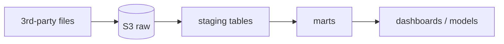

<!-- End-to-end flow. Every hop names its pipeline and its output table, and links to them.
     Prefer a layered table over a wall of text. A diagram is optional and must be reproducible (mermaid in a code block). -->

[TOC]

## The flow in one picture

## Layers
| Layer | What it holds | Grain | Built by | Consumed by |
|---|---|---|---|---|
| Raw / landing | files exactly as delivered | as delivered | provider | ingestion pipeline |
| Staging | typed, renamed, deduplicated | one row per source record | | |
| Intermediate | joins and business logic | | | |
| Marts | analysis-ready facts and dimensions | | | analysts, data science |

## Hop by hop
| # | From | To | Pipeline | What changes in this hop | Key assumptions |
|---|---|---|---|---|---|
| 1 | | | [Pipelines](30-pipelines.md) | | [Assumptions](60-assumptions-and-business-rules.md) |
